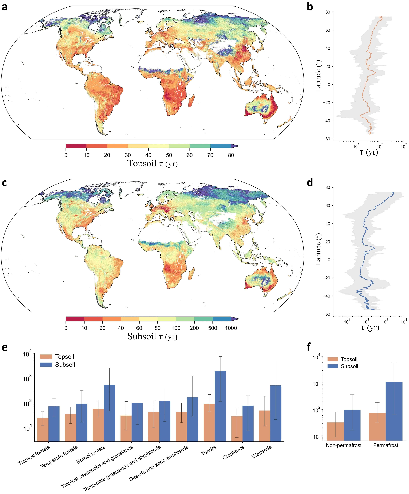

# Global Soil Carbon Turnover Time
This repository contains the code used for the analysis in the paper:

Zhang et al. Global patterns and controls of top- and subsoil organic carbon turnover times (in revision).

## Requirement
- Python3
- numpy
- pandas
- scipy
- scikit-learn
- cartopy
- xarray
- rioxarray
- seaborn
- matplotlib
- jupyterlab

## Description of files
- [**sample_data_processing**](https://github.com/leizhang-geo/global_soil_carbon_turnover_time/tree/main/sample_data_processing): The folder contains codes for preprocess the original soil sample datasets (WoSIS and NCSCD data). The procedure includes data screening, cleaning and transformation/complement.
- [**covariate_collection**](https://github.com/leizhang-geo/global_soil_carbon_turnover_time/tree/main/covariate_collection): The folder contains codes for collecting environmental covariate data from Google Earth Engine. The covariates mainly include four categories: climate, topography, soil physical and chemical properties.
- [**modelling**](https://github.com/leizhang-geo/global_soil_carbon_turnover_time/tree/main/modelling): The folder contains codes for generating the machine learning model to predictive mapping of the global SOC turnover time, and includes the understanding the environmental effects (controlling factors) on the SOC turnover.
- [**mapping_and_uncertainty**](https://github.com/leizhang-geo/global_soil_carbon_turnover_time/tree/main/mapping_and_uncertainty): The folder contains codes for visualize the global maps of SOC turnover times at top- and subsoil layers with their distribution of estimation uncertainty. It also contains codes for illustrating the key results in this study.
- [**datasets**](https://github.com/leizhang-geo/global_soil_carbon_turnover_time/tree/main/datasets): The folder contains the data (includes the open access soil profile datasets, environmental covariate data derived from ground-sourced and satelliate-based observations, and the compiled SOC turnover time data at sample locations across the globe) for the analysis in this study.

## License

The code and data shared in this <a xmlns:cc="http://creativecommons.org/ns#" xmlns:dct="http://purl.org/dc/terms/"><a property="dct:title" rel="cc:attributionURL" href="https://doi.org/10.3390/rs14184441">study</a> by <a rel="cc:attributionURL dct:creator" property="cc:attributionName" href="https://leizhang-geo.github.io">Lei Zhang</a> are licensed under <a href="http://creativecommons.org/licenses/by-nc/4.0/?ref=chooser-v1" target="_blank" rel="license noopener noreferrer" style="display:inline-block;">CC BY-NC 4.0</a>

## Contact

For questions and more details of our study please contact the author: Lei Zhang 张磊 (lei.zhang.geo@outlook.com)

Lei Zhang's [Homepage](https://leizhang-geo.github.io/)
